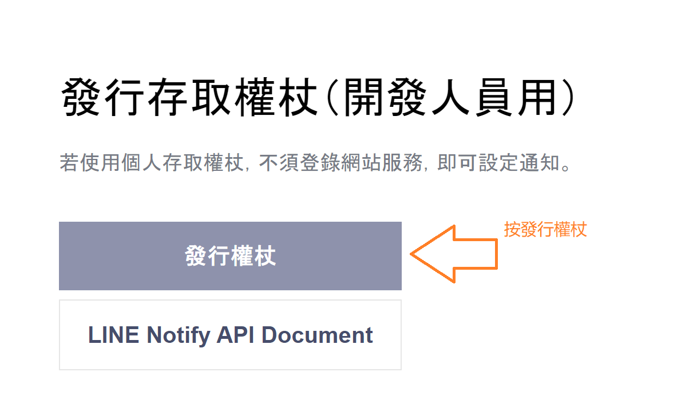
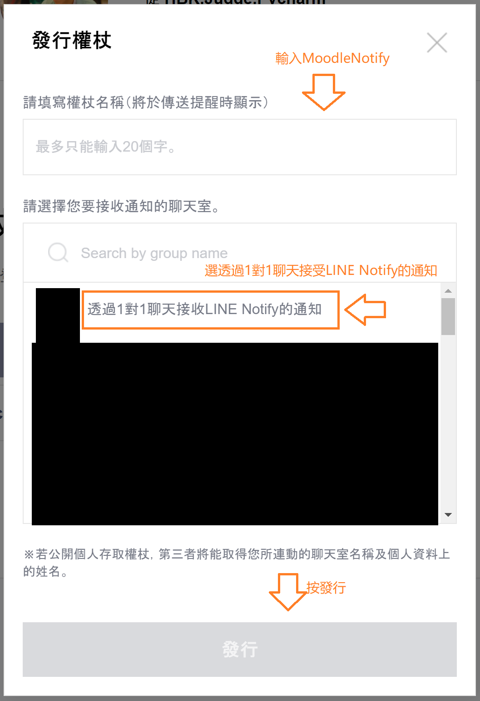
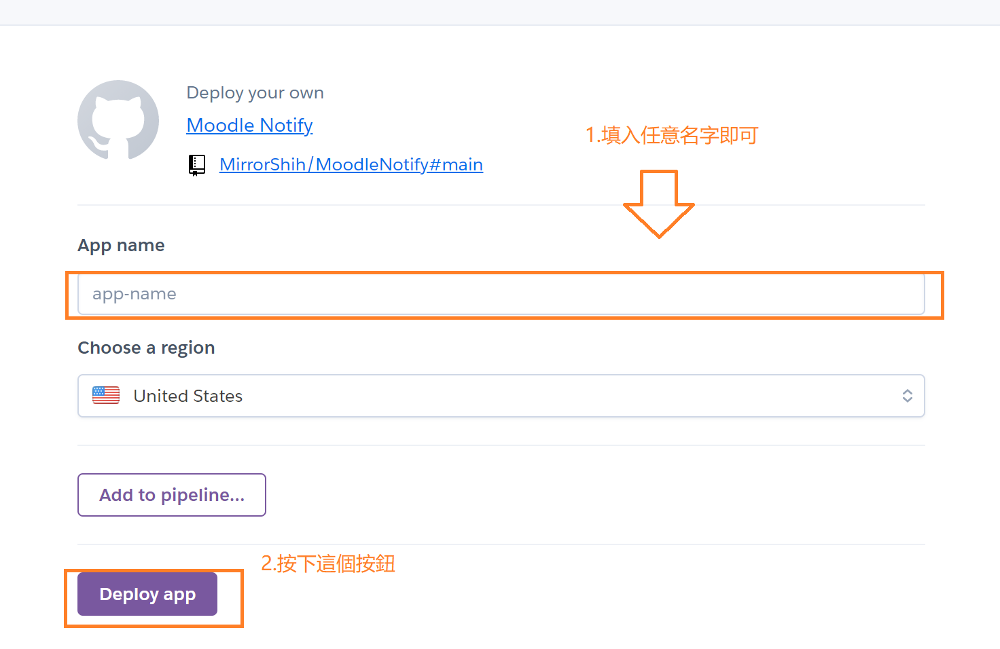
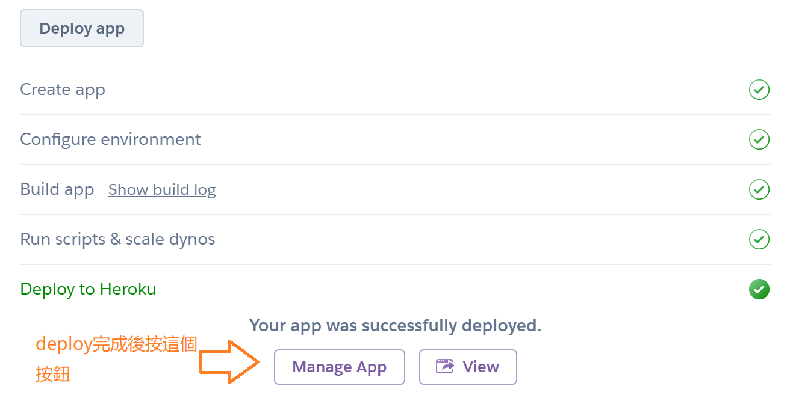
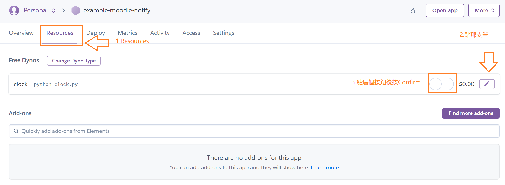

# MoodleNotify

A great assistant for reminding you of document updates on Moodle through Line notifications.
MoodleNotify will remind you daily of new information on Moodle, including:

#### 1.Files that have been modified within the last 24 hours

#### Assignments that have been modified within the last 24 hours and are still available for submission

#### 3.Exams that have started within the last 24 hours and are still available for taking.

## User Guide

### Environment Variables

There are four environment variables that need to be set by the user:
```
MOODLE_TOKEN
LINE_TOKEN
MOODLE_URL
NOTIFY_TIME
```

#### MOODLE_TOKEN
There are two methods to set up MOODLE_TOKEN, and we recommend using the first one:
Replace `YourMoodleURL` in the hyperlink below with your school's Moodle URL `ex:moodle.ntust.edu.tw`.
Replace `YourUsername` with your Moodle username.
Replace `YourPassword` with your Moodle password.

##### 1. 

There are slight differences in the first method based on the operating system:

###### Windows  

Open cmd (command prompt) and enter the following:
```
curl "https://YourMoodleURL/login/token.php?service=moodle_mobile_app" -d "username=YourUsername&password=YourPassword"
```

###### Linux  

Open terminal and enter the following:
```
curl -X POST -d 'username=YourUsername&password=YourPassword' https://YourMoodleURL/login/token.php?service=moodle_mobile_app
```

###### Mac

Open terminal and enter the following:
```
curl -X POST -d 'username=YourUsername&password=YourPassword' https://YourMoodleURL/login/token.php?service=moodle_mobile_app
```

##### 2.

<https://YourMoodleURL/login/token.php?username=YourUsername&password=YourPassword&service=moodle_mobile_app>

Enter the above URL in your browser, and you will receive your `MOODLE_TOKEN`. Note it down as you will need it later.

If your password contains special characters, and you cannot obtain a token, 
please go to https://www.urldecoder.org/ and decode the special characters in your password. 
Then replace the original special characters in your password with the decoded results. For example, 
replace "#" with "%23".

#### LINE_TOKEN

Click on [LINE Notify](https://notify-bot.line.me/my/) and then click on `Generate token` at the bottom of the page.



Enter `MoodleNotify` as the token name, select `1-on-1 chat with LINE Notify`, and generate the token.



Copy the token and note it down as you will need it later.

#### MOODLE_URL

Enter the Moodle URL used by your school, such as <https://moodle.ntust.edu.tw/>(the ending must be`/`)

#### NOTIFY_TIME

Set the time for MoodleNotify to remind you in 24-hour format(GMT+8). For example, setting it to 16 would remind you at 4 pm, and setting it to 8 would remind you at 8 am.

### Heroku

[](https://heroku.com/deploy)

Click on the `Deploy to Heroku` button above and follow these steps:

#### Enter the `app name` and the corresponding values for the 4 environment variables, and click `Deploy app`



#### Wait for `Deploy to Heroku` to turn green, and then click `Manage App`



#### Finally, go to the `Resources` tab and turn on the service.



### Docker

If you use Docker on your machine, you can try to deploy MoodleNotify on your own machine. 
Please follow the instructions below in the terminal.

#### Deploy MoodleNotify

##### 1. First, please download this project by yourself.
```bash
git clone https://github.com/MirrorShih/MoodleNotify.git
```

##### 2. Open the Dockerfile and fill in the environment variables mentioned above into the corresponding positions in lines 15-18. Then remove the `#` comments. The modified result will be as follows.
```dockerfile
# Environment Variables
ENV MOODLE_TOEKN=(Your MOODLE_TOKEN)
ENV LINE_TOKEN=(Your LINE_TOKEN)
ENV MOODLE_URL=(Your MOODLE_URL)
ENV NOTIFY_TIME=(Your NOTIFY_TIME)
```

##### 3. After modifying the Dockerfile, enter the following command to create an image
```bash
sudo docker build -t moodle_notify:latest .
```

##### 4. After the image is completed, create and run a container
```bash
sudo docker run -d --name moodle_notify moodle_notify:latest
```

That's it!

#### Remove MoodleNotify

If you need to remove MoodleNotify, please enter the following commands to remove the container and image
```bash
sudo docker rm -f moodle_notify
sudo docker rmi moodle_notify
```
